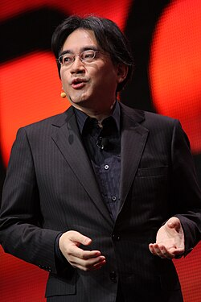
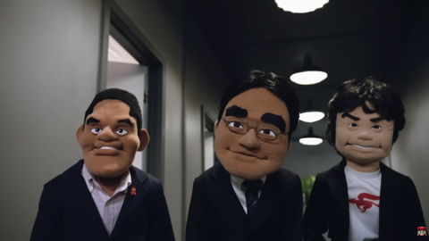

# **Petite biographie**
Satoru IWATA est né le 6 décembre 1958 et est mort le 11 juillet 2015. Lors de ses étude il c'est fait embauché à HAL Laboratory à temps partiel jusqu'a la fin de ses étude ou il devint employer à temps plein en 1982. En 1993 il en devient le président.

En 1984 Satoru IWATA programme à lui seul le jeu GOLF en assembleur.

En 2000, il rejoint Nintendo en tant que chef de la plannification et 2 ans plus tard il devient le 4^ème^ président. C'est sous sa direction que la DS et la WII fur conçu. Afin de promouvoir les jeux Nintendo de façon plus original il met en place des interviews nommé Iwata ask et des diffusions en directe nommé les Nintendo Direct dans lesquelle il annonce les prochaine sortie avec des petit sketchs.

