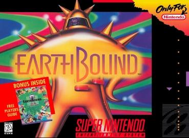
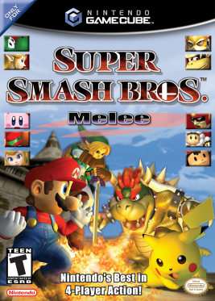

- [Mother 2(Earthbound)](#Mother-2(Hearthbound))
- [Super Smash Bros Melee](#Super-Smash-Bros-Melee)

# **Mother 2(Earthbound)**

Au bout de cinq ans de production de Mother 2 prévu pour la Super Nintendo, l'équipe stagne du à un code posant certain problèmes. En 1994 il vient en aide en réécrivant tout le programme du jeu en seulement six mois, alors que le jeu est déjà arriver à deux ans de developpement. Pour rappel les jeux Nes, Super Nintendo et Game boy sont programmer en assembleur.

# **Super Smash Bros Melee**

Tandis que Masahiro Sakurai s'acharnait sur la fin du developement de la suite de Super Smash Bros. Satoru IWATA arriva en renfort pour aider l'équipe à trouver et corriger les bugs du jeu.

