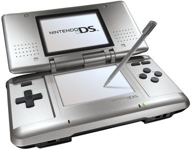
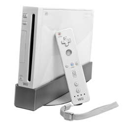

# **La DS et la Wii**

La DS est une console portable vendu par Nindendo dans les années 2000. La console à été dirigé par Satoru IWATA qui avait comme ligne diréctive l'originalité au lieu de la puissance, on retrouve se principe dans la Wii sortie en 2006 qui n'est sensiblement qu'une Game Cube une console sortie en 2000. Il se trouve que ses idée ont payées car la Nintendo DS et la Wii sont les consoles qui se sont le mieux vendu durant cette génération de consoles.

| Année en fonction de la date de sortie des consoles | Vente de la PSP(en millions) | Vente de la DS(en millions) |
| :------------ | :------------ | :------------ |
| Anné 1 |     3.0    |        5.3 |
| Anné 2 |     14.1     |        11.5 |
| Anné 3 |     9.5     |        23.6 |
| Anné 4 |     13.8     |        30.3 |
| Anné 5 |     14.1     |        31.2 |
| Anné 6 |     9.9     |        27.1 |
| Anné 7 |     8.0     |        17.5 |
| Anné 8 |     6.8     |        5.1 |

Au final La DS a écoulé 154,02 millions de console tandis que la PSP en vendu 80.82 millions .

