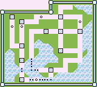
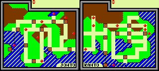

- [Pokémon OR ARGENT CRYSTAL](#pokémon-or-argent-crystal)
- [Pokémon STADIUM](#pokémon-stadium)

# **Pokémon OR ARGENT CRYSTAL**

Après le phenomène Pokémon en 1996 au Japon 1998 en Amérique du Nord et 1999 dans le reste du monde(en grande partie grace à Satoru IWATA), Game Freak les développeur planche de toute évidence sur une suite prévu comme le pokémon ultime. C'est dans ces conditions que Satoru IWATA intervient dans le développement afin d'aider la petite équipe en codant des outils de compréssion qui ont à la fin permis de doubler le contenu du jeu. Cette prouesse a permis l'integration Kanto, l'air de jeu de Pokémon Rouge Vert Bleu.

## comparaision des cartes des deux jeux
### Pokémon Rouge Vert Bleu

### Pokémon Or Argent et Crystal

# **Pokémon STADIUM**
Suite à son aide pour la localisation des premier pokémon qui lui à permis de comprendre l'intégralité du code des jeu Game Boy il a pu aider l'équipe du jeu Pokémon Stadium, un jeu Nintendo 64, à intégrer le système de combat en une semaine.

")
")